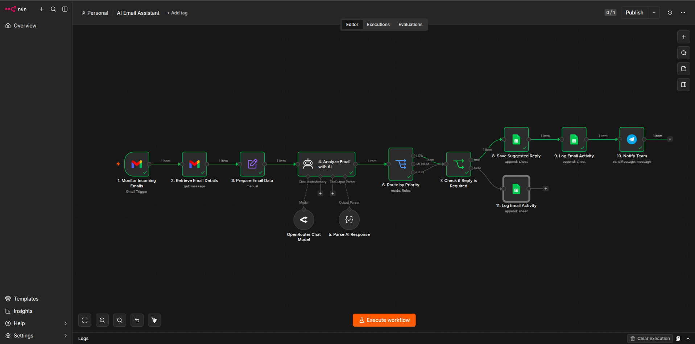

# 🤖 AI Email Assistant with n8n


An **AI-powered email automation workflow** built with **n8n** that intelligently processes incoming Gmail messages using AI. The workflow classifies emails, assigns priorities, determines whether a response is required, generates professional reply suggestions, logs activities, and notifies users for human review.

---

## 🚀 Features

- 📥 Monitor incoming Gmail messages automatically
- 🤖 AI-powered email analysis using OpenRouter
- 📝 Generate concise email summaries
- 🏷️ Categorize emails automatically
- 🚦 Assign priority levels (Low, Medium, High)
- 😊 Detect email sentiment
- ✉️ Determine whether an email requires a reply
- 💬 Generate professional AI reply suggestions
- 📋 Save suggested replies for human review
- 📊 Maintain an audit trail in Google Sheets
- 📲 Send Telegram notifications for actionable emails

---

## 🛠 Tech Stack

| Category | Technology |
|----------|------------|
| Workflow Automation | n8n |
| AI Model | OpenRouter |
| Email Service | Gmail API |
| Database | Google Sheets |
| Notifications | Telegram Bot |
| AI Processing | Large Language Model (LLM) |

---

## 🏗 Workflow Architecture

```text
Monitor Incoming Emails
        │
        ▼
Retrieve Email Details
        │
        ▼
Prepare Email Data
        │
        ▼
Analyze Email with AI
        │
        ▼
Parse AI Response
        │
        ▼
Route by Priority
        │
        ▼
Check if Reply is Required
      ┌────────────┴─────────────┐
      │                          │
     YES                       NO
      │                          │
      ▼                          ▼
Save Suggested Reply      Log Email Activity
      │                          │
      ▼                          ▼
Log Email Activity            End Workflow
      │
      ▼
Notify Team
```

---

## 📂 Google Sheets Structure

### 📋 Email Logs

| Timestamp | Sender | Subject | Summary | Category | Priority | Sentiment | Requires Reply | Status |
|-----------|---------|----------|---------|----------|----------|-----------|----------------|--------|

---

### 📝 Pending Replies

| Timestamp | Sender | Subject | Suggested Reply | Priority | Status | Thread ID |
|-----------|---------|----------|-----------------|----------|--------|-----------|

---

## 🧠 AI Structured Output

```json
{
  "summary": "string",
  "category": "string",
  "priority": "LOW | MEDIUM | HIGH",
  "sentiment": "POSITIVE | NEUTRAL | NEGATIVE",
  "requiresReply": true,
  "draftReply": "string"
}
```

---

## 📈 Business Value

This workflow helps organizations:

- Reduce manual email processing
- Improve response consistency
- Prioritize critical emails automatically
- Generate AI-assisted replies
- Keep humans in control before responding
- Maintain a searchable audit history
- Increase productivity through automation

---

## 📚 Skills Demonstrated

- AI Workflow Automation
- n8n Development
- Gmail API Integration
- OpenRouter Integration
- Prompt Engineering
- Structured AI Outputs
- Conditional Routing
- Human-in-the-Loop Automation
- Google Workspace Automation
- Google Sheets Integration
- Telegram Bot Integration
- Enterprise Workflow Design

---

## 📸 Workflow Screenshot

<p align="center">
  
</p>

---

## 🎥 Demo Video

📹 [Watch the demo](images/demo.mp4)

---

## 🚀 Future Improvements

- Gmail draft creation after n8n Gmail node enhancements
- Automatic email reply approval rules
- Multi-user approval workflow
- CRM integration
- Slack or Microsoft Teams notifications
- AI confidence scoring
- Analytics dashboard

---

## 📄 License

This project is licensed under the **MIT License**.

---

## 👨‍💻 Author

**Belio C. Sinangote**

🎓 BSIT Student | AI Automation Developer | n8n Enthusiast

- **GitHub:** https://github.com/belioautomation
- **LinkedIn:** https://www.linkedin.com/in/belio-sinangote-180375402/*

---

⭐ If you found this project helpful, consider giving it a **Star**!
